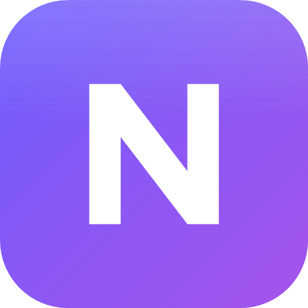
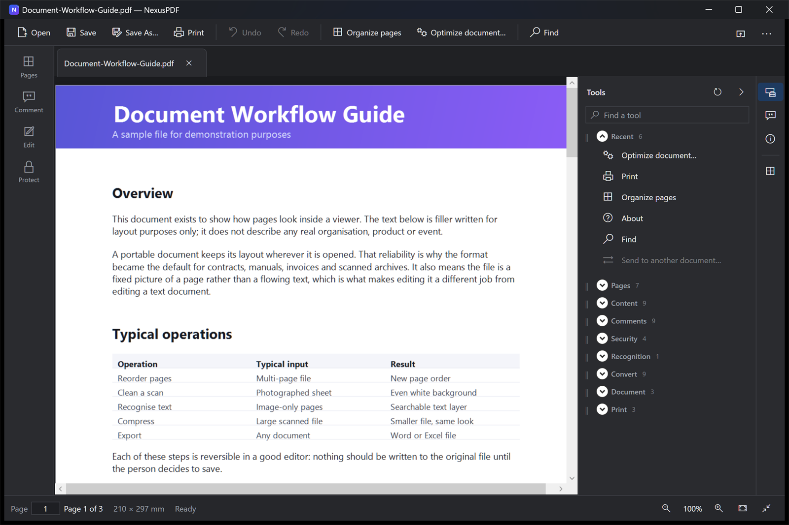
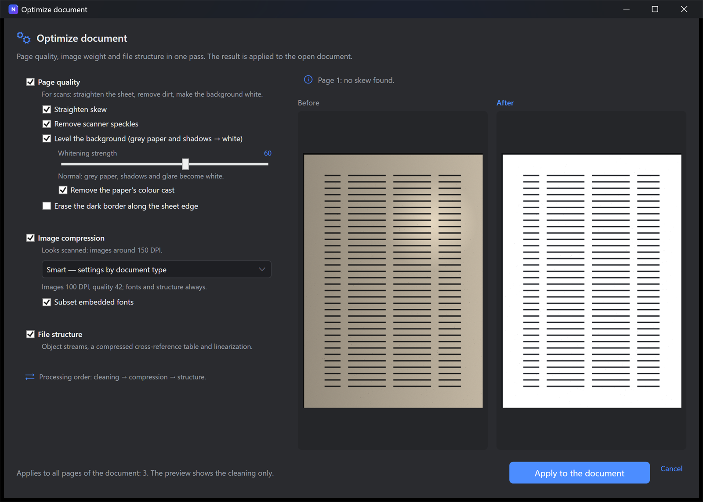
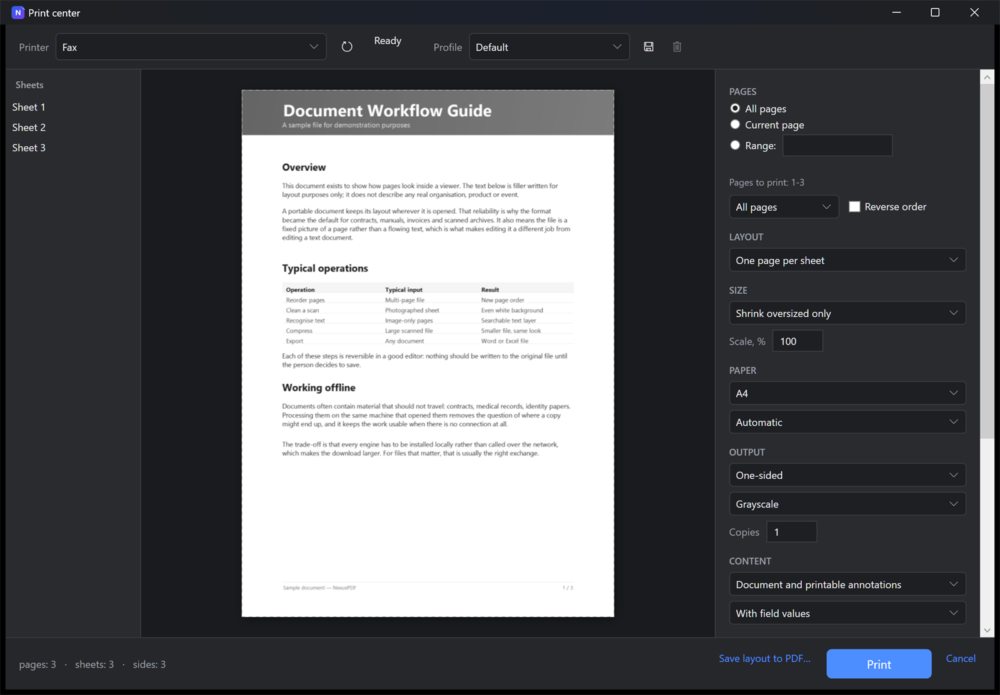

<div align="center">



# NexusPDF

### PDF work that never leaves your computer.

A desktop PDF editor for Windows. Read and rearrange pages, edit existing text and
images, annotate, fill forms, sign, recognise scanned text, clean up scans,
export to Word and Excel, and print — with every engine running on your own
processor. No account, no upload, no subscription.

[](https://nexus.internetdeco.com) [](https://nexus.internetdeco.com) [](https://dotnet.microsoft.com/download) [](LICENSE) [](#privacy)

**[Download](https://nexus.internetdeco.com)** · [Website](https://nexus.internetdeco.com) · [Changelog](https://nexus.internetdeco.com/changelog) · [Support the work](#support-the-work)



</div>

## Support the work

NexusPDF is free and stays free — no subscription, no paid tier, no ads, nothing
held back for a “pro” version. It is written by one person in his own time. If it
saved you an hour, a coffee is a fair trade.

<div align="center">

[](https://buymeacoffee.com/clfankitm8) [](https://nexus.internetdeco.com/#support) [](https://nexus.internetdeco.com/#support)

</div>

| Method | Details |
| --- | --- |
| **Buy Me a Coffee** | [buymeacoffee.com/clfankitm8](https://buymeacoffee.com/clfankitm8) — card, one-off or monthly |
| **Binance Pay** | ID `90127003` |
| **USDT · TRC20** | wallet address below |

```text
TLbuKujXxfZgAobVsQZ9igTFiGCB12x6Tq
```

All methods, with QR codes, are on the
[website](https://nexus.internetdeco.com/#support). Stars and bug reports help
just as much as money.

## What it does

| Feature | Details |
| --- | --- |
| **Pages in any order** | Reorder, rotate, duplicate, extract. Drag pages from one open document straight into another and drop them where you want. |
| **Scans that come out clean** | Straighten the sheet, remove scanner speckles, turn uneven grey paper into even white — with a before-and-after preview. |
| **Text and images edited in place** | Change existing text keeping its font, size and position. Replace a picture, or send a page to an image editor and bring it back. |
| **Text recognition, offline** | Scanned pages get a searchable text layer. Sixteen language packs ship with the program. |
| **Export to Word and Excel** | Paragraphs, tables, links and comments. Tables are taken from drawn borders, and where there are none, from column gaps. |
| **Print centre** | Booklets, posters, several pages per sheet, manual duplex, crop marks and bleed, with a preview of the actual sheet. |
| **Comments and drawing** | Highlight, note, pencil, line and arrow with stroke stabilisation. Every mark is a standard PDF annotation. |
| **Passwords and redaction** | AES-256 encryption, and redaction that removes the content underneath rather than covering it with a black box. |
| **Signatures and comparison** | Sign with a certificate, verify existing signatures, compare two files page by page. |
| **PDF previews in Explorer** | Folders and the desktop show the first page instead of a generic icon. Pages are read on demand, so a 240-page file costs no more than a one-page one. |

There is also a command-line tool (`NexusPdfCli`) for batch work: export, merge,
compress, protect, recognise and compare.

## Screenshots

<table>
<tr>
<td width="50%"></td>
<td width="50%"></td>
</tr>
<tr>
<td align="center"><b>Scan cleanup</b><br>before and after, on the same page</td>
<td align="center"><b>Print centre</b><br>the sheet as it will actually come out</td>
</tr>
</table>

Dark and light themes, three interface languages: English, Russian, Ukrainian.

## Privacy

Documents are processed locally and never uploaded. There is no account, no
licence server and no telemetry. Nothing is sent while you work — the program
opens no network connections at all. Logs stay on the device and never contain
document content or passwords.

## System requirements

- Windows 10 version 21H2 or Windows 11, 64-bit
- About 1 GB of free disk space
- 4 GB of memory; 8 GB is more comfortable for large scans
- No .NET installation needed — the runtime is included
- No internet connection required, during install or afterwards
- Administrator rights once, at install time, for the all-users mode. It is the
  default because PDF previews in Explorer are registered machine-wide: the
  isolated process Windows builds thumbnails in cannot see per-user
  registration. Installing just for yourself needs no rights and works fine,
  only without the previews.

## Building from source

Requires the [.NET 10 SDK](https://dotnet.microsoft.com/download) and Windows.
The Explorer thumbnail handler is native code, so the full build also needs
Visual Studio with the C++ desktop workload; `dotnet build` alone does not.

```powershell
./build.ps1 -All
```

This restores the pinned native dependencies (qpdf, Tesseract data, OCR models —
versions and SHA-256 sums are in `tools/*.lock.json`), builds, runs the tests,
and produces the installer, the MSI and a portable archive in `artifacts/`.

For a plain build and test run:

```powershell
dotnet build NexusPdf.slnx -c Release
dotnet test tests/NexusPdf.UnitTests -c Release
```

More detail in [docs/BUILD.md](docs/BUILD.md) and
[docs/ARCHITECTURE.md](docs/ARCHITECTURE.md). Most documentation in `docs/` is
written in Russian.

## Licence

NexusPDF is licensed under the **GNU Affero General Public License v3.0** — see
[LICENSE](LICENSE).

The reason is MuPDF: document compression uses MuPDF by Artifex Software, which
is distributed under the AGPL-3.0. Bundling it means the combined work carries
the same licence. In practice: you may use, study, modify and redistribute
NexusPDF, and anyone who distributes a modified version must publish their source
under the same terms.

## Third-party components

| Component | Purpose | Licence |
| --- | --- | --- |
| PDFium | page rendering, text and content editing | Apache-2.0 / BSD-3-Clause |
| qpdf | file structure, AES-256 encryption, optimization | Apache-2.0 |
| MuPDF, MuPDF.NET | image and font compression | AGPL-3.0 |
| PaddleOCR (via RapidOcrNet) + ONNX Runtime | text recognition | Apache-2.0 / MIT |
| Tesseract + Leptonica | fallback recognition | Apache-2.0 / BSD-2-Clause |
| DocumentFormat.OpenXml | export to Word and Excel | MIT |
| SkiaSharp, Clipper2 | raster and geometry | MIT / BSL-1.0 |
| .NET, WPF, CommunityToolkit.Mvvm | platform | MIT |
| Serilog | logging | Apache-2.0 |
| gong-wpf-dragdrop | drag and drop | BSD-3-Clause |

Full notices: [docs/THIRD_PARTY_NOTICES.md](docs/THIRD_PARTY_NOTICES.md).
Licence compatibility is tracked in
[docs/DEPENDENCY_AND_LICENSE_MATRIX.md](docs/DEPENDENCY_AND_LICENSE_MATRIX.md).

## Known limitations

Kept deliberately honest, not hidden:
[docs/KNOWN_LIMITATIONS.md](docs/KNOWN_LIMITATIONS.md),
[docs/PRINT_KNOWN_LIMITATIONS.md](docs/PRINT_KNOWN_LIMITATIONS.md).

The builds are not code-signed, so SmartScreen warns on download. Checksums are
published with every release.

---

<div align="center">

Crafted by Artur Yurchuk

</div>
